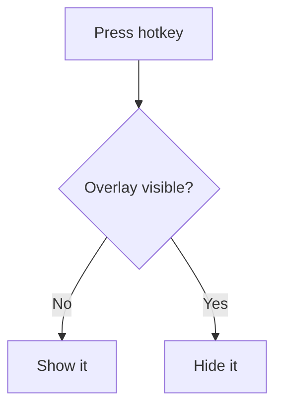

# Note Taker — Stack Reference

**What every tool, library, and API in this project is, and what it does here.**

`DOCUMENTATION.md` covers *what we decided and why*. This file covers *what the pieces are* — it's
the one to read when you hit a name in the codebase and think "what is that, actually?"
`ROADMAP.md` covers *where the project is*, and `README.md` is the front door for using it.

Versions are those installed as of 2026-08-10.

---

## Quick map

| Package | Version | Layer | Job in this project |
|---|---|---|---|
| `electron` | 43.3.0 | runtime | The desktop app runtime: windows, hotkeys, OS access |
| `electron-vite` | 5.0.0 | build | Builds all three processes; hot reload in dev |
| `vite` | 7.3.6 | build | The underlying bundler/dev server |
| `@vitejs/plugin-react` | 5.2.0 | build | JSX transform + React Fast Refresh |
| `typescript` | 7.0.2 | build | Type checking (`tsc --noEmit`) |
| `electron-builder` | 26.15.3 | release | Turns the build into a portable `.exe` / `.dmg` / `.AppImage` |
| `vitest` | 4.1.10 | test | Unit tests |
| `oxlint` | 1.78.0 | quality | The linter. Rust-based; replaces ESLint (see §2) |
| `react` / `react-dom` | 19.2.8 | UI | The interface |
| `framer-motion` | 13.0.0 | UI | Spring animations |
| `@codemirror/*` | 6.x | UI | The markdown text editor |
| `@lezer/highlight` | 1.2.3 | UI | Syntax highlighting tags CodeMirror styles against |
| `marked` | 18.0.9 | content | Markdown → HTML for the preview |
| `mermaid` | 11.16.1 | content | Diagram blocks → SVG (lazy-loaded) |

> **Why is React in `devDependencies`?**
> It looks wrong, but it's correct for Electron. Vite *bundles* React into the renderer output, so
> it doesn't need to exist in `node_modules` at runtime. `electron-builder` ships `dependencies`
> into the packaged app and drops `devDependencies` — so anything bundled belongs in dev, and
> putting it in `dependencies` would just make the installer bigger for no reason. Only packages
> `require()`d at runtime by the **main** process (unbundled, per `externalizeDepsPlugin`) belong
> in `dependencies`.

---

## 1. Electron

A desktop app runtime: Chromium for rendering plus Node.js for OS access, in one package. VS Code,
Slack, Discord, Figma and 1Password are all Electron.

### The APIs this project actually uses

**`app`** — the application lifecycle object.
- `app.whenReady()` — a promise resolving when Electron can create windows. Nothing may touch
  `BrowserWindow` before it.
- `app.requestSingleInstanceLock()` — returns `false` if another copy is already running. Critical
  here: a second instance would fail to claim the hotkey and appear broken.
- `app.isPackaged` — `false` in dev, `true` in a built app. We use it to decide whether to load the
  renderer from the dev server or from disk.
- `app.on('will-quit')` — last chance to release OS-level resources.

**`BrowserWindow`** — one window, which is also one renderer process. The options that make it an
overlay rather than a normal window:

| Option | Effect |
|---|---|
| `frame: false` | No OS title bar or border; we draw our own |
| `transparent: true` | Window background can be see-through |
| `alwaysOnTop` | Floats above other windows |
| `skipTaskbar: true` | Hidden from the taskbar and alt-tab |
| `show: false` | Starts invisible — we control the reveal |
| `hasShadow: false` | Suppresses the native shadow so it can't clip our rounded corners |

Plus two methods: `setAlwaysOnTop(true, 'screen-saver')` raises it above *fullscreen* apps (plain
`true` isn't enough), and `setVisibleOnAllWorkspaces()` makes it follow you across virtual desktops.

**`globalShortcut`** — registers an OS-wide hotkey that fires even when the app has no focus.
- `register(accelerator, cb)` returns `false` if another process already owns that combination —
  always check it, silent failure here is baffling to debug.
- Registrations live in the OS, not the JS heap, so `unregisterAll()` on quit is mandatory.
- Accelerator syntax: `'CommandOrControl+Space'` (our default), where `CommandOrControl` resolves to
  Cmd on macOS and Ctrl elsewhere.

**`screen`** — multi-monitor geometry. Available only after `whenReady()`.
- `getCursorScreenPoint()` + `getDisplayNearestPoint()` together answer "which monitor is the user
  looking at?" — we position the overlay there rather than on the primary display.
- `display.workArea` vs `display.bounds`: `workArea` excludes the taskbar. Using `bounds` is a
  classic bug where your window ends up partly underneath it.

**`ipcMain` / `ipcRenderer`** — message passing between processes. Two patterns:
- **Fire-and-forget:** `ipcRenderer.send(channel, ...)` → `ipcMain.on(channel, handler)`.
- **Request/response:** `ipcRenderer.invoke(channel, ...)` returns a promise →
  `ipcMain.handle(channel, handler)`. This is what file operations will use.

Everything crossing IPC is serialized (structured clone), so you can pass objects and arrays but
**not** functions, class instances, or DOM nodes.

**`contextBridge`** — the only way to expose anything to the page when `contextIsolation` is on.
`contextBridge.exposeInMainWorld('api', obj)` copies `obj` onto the renderer's `window`. A plain
`window.api = ...` in the preload would land in the preload's *own* isolated context and be
invisible to your React code — a very common early confusion.

### The three security flags

```ts
contextIsolation: true   // preload and page get separate JS contexts
nodeIntegration: false   // no require() / process in the page
sandbox: true            // renderer runs in Chromium's OS sandbox
```

All three are the modern defaults and none should be relaxed. Together they mean the renderer
cannot touch the filesystem except through capabilities we explicitly hand it.

---

## 2. Build tooling

### Vite

A dev server and bundler. Two modes, and the difference explains most of its behaviour:
- **Dev:** serves your source as native ES modules with no bundling, so startup is instant and
  edits appear immediately (HMR).
- **Build:** bundles with Rollup, minifies, splits chunks.

### electron-vite

Vite doesn't natively understand that an Electron app is *three* programs with different targets.
`electron-vite` adds that: one `electron.vite.config.ts` with `main`, `preload`, and `renderer`
sections, correct module format and globals for each, and hot reload wired across all three
(renderer hot-reloads; main and preload restart the app).

Two pieces worth knowing:
- **`externalizeDepsPlugin()`** — tells Vite *not* to bundle `node_modules` into the main process.
  Bundling helps a browser (fewer requests); for local Node code it just slows builds and breaks
  native modules.
- **`ELECTRON_RENDERER_URL`** — the env var it sets in dev holding the dev server address. Its
  presence is how the main process knows to `loadURL` instead of `loadFile`.

### TypeScript — and the trap

`electron-vite` compiles via **esbuild**, which *strips* types without checking them. That's why
it's fast, and it means **type errors do not fail a build**. This is why `npm run build` runs
`tsc --noEmit` first — that step is what makes the types real. Skip it and TypeScript is decoration.

The project has three configs because main and renderer run in different worlds:

| File | Covers | `lib` | Has |
|---|---|---|---|
| `tsconfig.node.json` | main + preload | `ES2022` | Node globals, no DOM |
| `tsconfig.web.json` | renderer | `ES2022`, `DOM` | DOM + JSX, no Node |
| `tsconfig.json` | — | — | Just references the other two |

With a single shared config, TypeScript would autocomplete `document` inside your main process and
you'd only find out at runtime.

### electron-builder

Takes the compiled `out/` directory and produces real distributables: a **portable `.exe`** on
Windows, `.dmg` on macOS, `.AppImage`/`.deb` on Linux. Also handles code signing (not used here) and
can publish straight to GitHub Releases — which is what the release workflow will use.

Config lives in `electron-builder.yml`. The pieces worth knowing:

- **`files`** — what actually ships. Only `out/**` and `package.json`; source and the `node_modules`
  Vite already bundled would just inflate the download.
- **`extraResources`** — copied next to the app rather than into the bundle, reachable at runtime
  via `process.resourcesPath`. The tray icon needs this: it must be a real file on disk, so Vite
  cannot bundle it the way it bundles the renderer's assets.
- **`win.target: portable`** — a self-extracting archive rather than an installer. See
  DOCUMENTATION.md §3.6 for why, including the two consequences: no `electron-updater` support, and
  the need to pin `unpackDirName` so it doesn't unpack to a fresh temp folder on every launch.
- **`artifactName`** — spelled out rather than derived from `${productName}`, which contains a
  space. This string becomes the download filename on GitHub Releases.

### Vitest

Vite-native test runner with a Jest-compatible API (`describe`/`it`/`expect`). It reuses the Vite
config, so TypeScript works without extra setup. No config file is needed here: Vitest looks for
`vite.config.*`, and this project's is named `electron.vite.config.ts`, so the defaults apply.

Suited to pure logic rather than to Electron windows — which is exactly the constraint that shaped
`src/main/note-utils.ts`. `notes.ts` imports `electron` at module scope and cannot be loaded outside
an Electron runtime, so the testable half lives in its own module (DOCUMENTATION.md §3.7).

`npm run test` is deliberately **not** given `--passWithNoTests`. If the suite ever disappears, that
should fail the build rather than quietly succeed.

### oxlint

The linter — a Rust reimplementation of ESLint's rule set, run as a single binary.

It is here because **ESLint could not be installed**: `typescript-eslint` declares a peer range of
`>=4.8.4 <6.1.0` and this project is on TypeScript 7. Oxlint parses TypeScript itself, needs no
TypeScript peer, and pulls in 2 packages rather than ~100 (DOCUMENTATION.md §2.8).

- Config is `.oxlintrc.json`, in **JSONC** — comments are supported and used to justify every
  suppression.
- Rules are grouped into **categories** (`correctness`, `suspicious`, `pedantic`, `perf`, `style`,
  `restriction`, `nursery`). Here `correctness` and `suspicious` are errors; `perf` is advisory.
- **Plugins are opt-in.** `react` is *off* by default — easy to miss, and it is what provides
  `react-hooks/exhaustive-deps`. This project enables `typescript`, `unicorn`, `oxc`, `react`,
  `promise` and `import`, for 265 active rules.
- **It exits 0 on warnings by default.** `npm run lint` passes `--deny-warnings` so CI can fail.
- `eslint-disable-next-line` comments are honoured, so existing suppressions keep working.
- Useful flags: `--fix`, `--print-config` (what's actually enabled), `-f github` (workflow
  annotations), `--report-unused-disable-directives`.

**Limitation:** no type-aware rules. Those need a real type checker, which is the thing oxlint
deliberately does without in order to be fast.

---

## 3. UI libraries

### React 19

The interface layer. The only React-specific gotcha in this codebase: **strict mode double-mounts
components in development** to surface effect bugs. Any `useEffect` that subscribes to something
must return a cleanup function, or you'll stack duplicate listeners. That's why `api.onShown()`
in the preload returns an unsubscribe function.

### CodeMirror 6

A modular code editor. Very different from CodeMirror 5 or Monaco — worth understanding the model
before editing editor code:

- **`EditorState`** is immutable. You never mutate the document; you dispatch a **transaction**
  describing a change and get a new state back.
- **`EditorView`** owns the DOM and renders a state.
- **Extensions** are the unit of composition. Line numbers, history, markdown syntax, key bindings,
  and themes are all just extensions in an array. You import only what you use — which is what
  keeps it small.

Packages here: `@codemirror/state` (documents/transactions), `@codemirror/view` (DOM),
`@codemirror/commands` (undo, history, standard keymap), `@codemirror/language` (syntax
infrastructure), `@codemirror/lang-markdown` (markdown grammar).

> **Size gotcha:** `@codemirror/lang-markdown` depends on `@codemirror/lang-html`, which in turn
> pulls in the JavaScript and CSS grammars — because markdown permits raw HTML, including
> `<script>` and `<style>`. So choosing markdown highlighting silently brings four language
> parsers, and the CodeMirror chunk lands around 880 kB rather than the ~350 kB you'd expect.
> Unavoidable without forking the package.

`@lezer/highlight` provides the *tags* — abstract labels like "heading", "emphasis", "link" — that
a theme assigns colours to. Lezer is the parser system underneath CodeMirror 6.

### Framer Motion

Animation library. The reason it's here rather than CSS transitions is **spring physics**:

```tsx
transition={{ type: 'spring', stiffness: 400, damping: 30 }}
```

Springs are defined by physical properties (stiffness, damping, mass) rather than a duration and a
curve, so motion has weight and settles naturally instead of stopping dead at a fixed time. That
quality is most of what reads as "Apple-like", and it's the highest-leverage detail in the UI.

Also provides `AnimatePresence`, which keeps a component mounted long enough to animate *out* —
otherwise React would remove it from the DOM instantly.

---

## 4. Content pipeline

### marked

Markdown → HTML. Small, fast, and extensible via a renderer/plugin hook, which is how we intercept
` ```mermaid ` fenced blocks before they become ordinary `<pre><code>`.

> **Security note for later:** `marked` output goes into the DOM. Since markdown allows raw HTML,
> a note containing `<script>` is a real (if self-inflicted) XSS vector. Before shipping, either
> sanitize the output or disable raw HTML in the parser.

### mermaid

Renders text descriptions into SVG diagrams — flowcharts, sequence diagrams, Gantt charts:

````

````

**It is the largest dependency in the project by a wide margin** — bigger than everything else
combined. Hence `await import('mermaid')` rather than a top-level import: the cost is paid only by
notes that actually contain a diagram. Its API is essentially `mermaid.initialize(config)` once,
then `mermaid.render(id, source)` per diagram, returning `{ svg }`.

---

## 5. Config files

| File | Purpose |
|---|---|
| `package.json` | Dependencies and the `dev` / `build` / `dist` / `lint` / `test` scripts |
| `electron.vite.config.ts` | Build config for all three processes |
| `tsconfig*.json` | Type checking, split by runtime environment |
| `electron-builder.yml` | Packaging config — portable `.exe`, `.dmg`, `.AppImage` |
| `.oxlintrc.json` | Lint rules, categories, plugins, and the reasoning for each suppression |
| `.github/workflows/*.yml` | CI and release pipelines *(not yet written)* |

---

## 6. Glossary

- **Main process** — the Node.js process. One per app. Owns windows and OS access.
- **Renderer process** — a Chromium process running your UI. One per window. Sandboxed.
- **Preload script** — runs before the page loads, bridging main and renderer.
- **IPC** — inter-process communication; the message passing between them.
- **Context isolation** — keeping preload and page JavaScript in separate contexts.
- **Accelerator** — Electron's string format for a key combination.
- **Work area** — a display's usable region, excluding taskbar/dock.
- **HMR / Fast Refresh** — swapping edited modules into a running app without a reload.
- **Tree shaking** — dropping code that's never imported.
- **Code splitting** — emitting multiple bundles so some can load lazily.
- **Transaction** (CodeMirror) — an immutable description of a document change.

---

## 7. Troubleshooting

### `Error: Electron uninstall` when running `npm run dev`

The `electron` npm package is only a small wrapper; the actual ~100MB Chromium binary is fetched by
a **postinstall script**. If that step is skipped or blocked (offline, proxy, `--ignore-scripts`,
a restricted CI runner), `node_modules/electron/` will have no `dist/` folder and no `path.txt`,
and electron-vite reports it as "uninstall".

Fix — re-run the download without reinstalling everything:

```bash
node node_modules/electron/install.js
```

Verify with `ls node_modules/electron/dist`. This is also worth knowing for CI, where the download
is the slowest part of a cold build and the first thing to cache.

### `error TS5102: Option 'baseUrl' has been removed`

TypeScript 7 removed `baseUrl`. Path aliases must now be **relative to the tsconfig file**:

```jsonc
// Before (TS ≤6)                    After (TS 7)
"baseUrl": ".",                      "paths": { "@/*": ["./src/renderer/src/*"] }
"paths": { "@/*": ["src/..."] }
```

Remember the alias is declared **twice** — in `tsconfig.web.json` for type resolution and in
`electron.vite.config.ts` for actual module resolution. They must agree, and nothing enforces it.

### `TypeError: Cannot read properties of undefined (reading 'app')`

Any `electron.<something>` being undefined in the main process usually means Electron booted as
**plain Node** rather than as an app. In that mode `require('electron')` returns a path string
instead of the API.

The giveaway is in the stack trace: `node:electron/js2c/node_init` (Node mode) instead of
`node:electron/js2c/browser_init` (normal).

The cause is the `ELECTRON_RUN_AS_NODE=1` environment variable, which some tooling sets for its
own child processes and which then leaks into your shell. Check with `echo $ELECTRON_RUN_AS_NODE`
and clear it with `unset ELECTRON_RUN_AS_NODE` (PowerShell: `$env:ELECTRON_RUN_AS_NODE=''`).

### Nothing happens when I press the hotkey

Check the terminal for `Could not register hotkey`. Another application already owning the
combination is the usual cause, and `globalShortcut.register` returns `false` rather than throwing.

### The tray icon disappears after a few seconds

The `Tray` object was garbage collected. It must be held in a module-scoped variable, not a local.

### `npm error ERESOLVE` when installing anything ESLint-related

```
peer typescript@">=4.8.4 <6.1.0" from typescript-eslint@8.67.0
Found: typescript@7.0.2
```

Not a lockfile problem, and **`--legacy-peer-deps` / `--force` is the wrong fix.** No published
`typescript-eslint` supports TypeScript 7; forcing it installs a parser built against a compiler API
that TS 7 replaced. The linter would run, report almost nothing, and be trusted anyway.

This project uses oxlint instead (§2). If you specifically need ESLint, the only clean route is
pinning TypeScript back to 6.x — which would reintroduce the `baseUrl` behaviour below.

### `Invalid note id` errors when opening a note

Working as designed. Ids are restricted to `[a-z0-9-]{1,64}`, and anything else throws before
touching the filesystem — this is the path-traversal defence, not a bug. A file added to the notes
folder by hand with a name like `My Notes.md` or `notes.2026.md` will be listed but will fail to
open. Rename it to lowercase letters, digits and hyphens.

---

## 8. Official documentation

- Electron — <https://www.electronjs.org/docs/latest>
- Electron security checklist — <https://www.electronjs.org/docs/latest/tutorial/security>
- electron-vite — <https://electron-vite.org>
- electron-builder — <https://www.electron.build>
- Vite — <https://vite.dev>
- CodeMirror 6 system guide — <https://codemirror.net/docs/guide/>
- Framer Motion — <https://motion.dev/docs>
- marked — <https://marked.js.org>
- mermaid — <https://mermaid.js.org>
