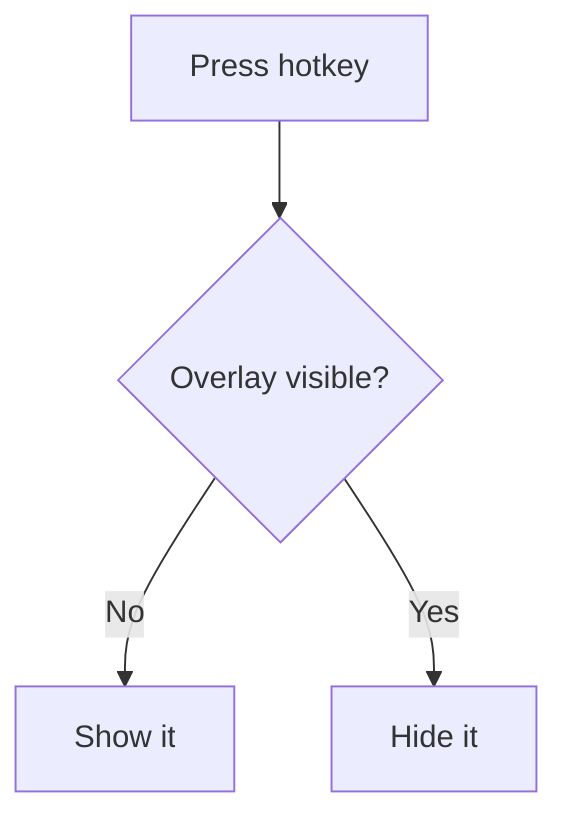

# Note Taker — Stack Reference

**What every tool, library, and API in this project is, and what it does here.**

`DOCUMENTATION.md` covers *what we decided and why*. This file covers *what the pieces are* — it's
the one to read when you hit a name in the codebase and think "what is that, actually?"
`ROADMAP.md` covers *where the project is*, and `README.md` is the front door for using it.

Versions are those installed as of 2026-08-10.

---

## Quick map

| Package | Version | Layer | Job in this project |
|---|---|---|---|
| `electron` | 43.3.0 | runtime | The desktop app runtime: windows, hotkeys, OS access |
| `electron-vite` | 5.0.0 | build | Builds all three processes; hot reload in dev |
| `vite` | 7.3.6 | build | The underlying bundler/dev server |
| `@vitejs/plugin-react` | 5.2.0 | build | JSX transform + React Fast Refresh |
| `typescript` | 7.0.2 | build | Type checking (`tsc --noEmit`) |
| `electron-builder` | 26.15.3 | release | Turns the build into a portable `.exe` / `.dmg` / `.AppImage` |
| `vitest` | 4.1.10 | test | Unit tests |
| `oxlint` | 1.78.0 | quality | The linter. Rust-based; replaces ESLint (see §2) |
| `react` / `react-dom` | 19.2.8 | UI | The interface |
| `framer-motion` | 13.0.0 | UI | Spring animations |
| `@codemirror/*` | 6.x | UI | The markdown text editor |
| `@lezer/highlight` | 1.2.3 | UI | Syntax highlighting tags CodeMirror styles against |
| `marked` | 18.0.9 | content | Markdown → HTML for the preview |
| `mermaid` | 11.16.1 | content | Diagram blocks → SVG (lazy-loaded) |

> **Why is React in `devDependencies`?**
> It looks wrong, but it's correct for Electron. Vite *bundles* React into the renderer output, so
> it doesn't need to exist in `node_modules` at runtime. `electron-builder` ships `dependencies`
> into the packaged app and drops `devDependencies` — so anything bundled belongs in dev, and
> putting it in `dependencies` would just make the installer bigger for no reason. Only packages
> `require()`d at runtime by the **main** process (unbundled, per `externalizeDepsPlugin`) belong
> in `dependencies`.

---

## 1. Electron

A desktop app runtime: Chromium for rendering plus Node.js for OS access, in one package. VS Code,
Slack, Discord, Figma and 1Password are all Electron.

### The APIs this project actually uses

**`app`** — the application lifecycle object.
- `app.whenReady()` — a promise resolving when Electron can create windows. Nothing may touch
  `BrowserWindow` before it.
- `app.requestSingleInstanceLock()` — returns `false` if another copy is already running. Critical
  here: a second instance would fail to claim the hotkey and appear broken.
- `app.isPackaged` — `false` in dev, `true` in a built app. We use it to decide whether to load the
  renderer from the dev server or from disk.
- `app.on('will-quit')` — last chance to release OS-level resources.

**`BrowserWindow`** — one window, which is also one renderer process. The options that make it an
overlay rather than a normal window:

| Option | Effect |
|---|---|
| `frame: false` | No OS title bar or border; we draw our own |
| `transparent: true` | Window background can be see-through |
| `alwaysOnTop` | Floats above other windows |
| `skipTaskbar: true` | Hidden from the taskbar and alt-tab |
| `show: false` | Starts invisible — we control the reveal |
| `hasShadow: false` | Suppresses the native shadow so it can't clip our rounded corners |

Plus two methods: `setAlwaysOnTop(true, 'screen-saver')` raises it above *fullscreen* apps (plain
`true` isn't enough), and `setVisibleOnAllWorkspaces()` makes it follow you across virtual desktops.

**`globalShortcut`** — registers an OS-wide hotkey that fires even when the app has no focus.
- `register(accelerator, cb)` returns `false` if another process already owns that combination —
  always check it, silent failure here is baffling to debug.
- Registrations live in the OS, not the JS heap, so `unregisterAll()` on quit is mandatory.
- Accelerator syntax: `'CommandOrControl+Space'` (our default), where `CommandOrControl` resolves to
  Cmd on macOS and Ctrl elsewhere.

**`screen`** — multi-monitor geometry. Available only after `whenReady()`.
- `getCursorScreenPoint()` + `getDisplayNearestPoint()` together answer "which monitor is the user
  looking at?" — we position the overlay there rather than on the primary display.
- `display.workArea` vs `display.bounds`: `workArea` excludes the taskbar. Using `bounds` is a
  classic bug where your window ends up partly underneath it.

**`ipcMain` / `ipcRenderer`** — message passing between processes. Two patterns:
- **Fire-and-forget:** `ipcRenderer.send(channel, ...)` → `ipcMain.on(channel, handler)`.
- **Request/response:** `ipcRenderer.invoke(channel, ...)` returns a promise →
  `ipcMain.handle(channel, handler)`. This is what file operations will use.

Everything crossing IPC is serialized (structured clone), so you can pass objects and arrays but
**not** functions, class instances, or DOM nodes.

**`contextBridge`** — the only way to expose anything to the page when `contextIsolation` is on.
`contextBridge.exposeInMainWorld('api', obj)` copies `obj` onto the renderer's `window`. A plain
`window.api = ...` in the preload would land in the preload's *own* isolated context and be
invisible to your React code — a very common early confusion.

### The three security flags

```ts
contextIsolation: true   // preload and page get separate JS contexts
nodeIntegration: false   // no require() / process in the page
sandbox: true            // renderer runs in Chromium's OS sandbox
```

All three are the modern defaults and none should be relaxed. Together they mean the renderer
cannot touch the filesystem except through capabilities we explicitly hand it.

---

## 2. Build tooling

### Vite

A dev server and bundler. Two modes, and the difference explains most of its behaviour:
- **Dev:** serves your source as native ES modules with no bundling, so startup is instant and
  edits appear immediately (HMR).
- **Build:** bundles with Rollup, minifies, splits chunks.

### electron-vite

Vite doesn't natively understand that an Electron app is *three* programs with different targets.
`electron-vite` adds that: one `electron.vite.config.ts` with `main`, `preload`, and `renderer`
sections, correct module format and globals for each, and hot reload wired across all three
(renderer hot-reloads; main and preload restart the app).

Two pieces worth knowing:
- **`externalizeDepsPlugin()`** — tells Vite *not* to bundle `node_modules` into the main process.
  Bundling helps a browser (fewer requests); for local Node code it just slows builds and breaks
  native modules.
- **`ELECTRON_RENDERER_URL`** — the env var it sets in dev holding the dev server address. Its
  presence is how the main process knows to `loadURL` instead of `loadFile`.

### TypeScript — and the trap

`electron-vite` compiles via **esbuild**, which *strips* types without checking them. That's why
it's fast, and it means **type errors do not fail a build**. This is why `npm run build` runs
`tsc --noEmit` first — that step is what makes the types real. Skip it and TypeScript is decoration.

The project has three configs because main and renderer run in different worlds:

| File | Covers | `lib` | Has |
|---|---|---|---|
| `tsconfig.node.json` | main + preload | `ES2022` | Node globals, no DOM |
| `tsconfig.web.json` | renderer | `ES2022`, `DOM` | DOM + JSX, no Node |
| `tsconfig.json` | — | — | Just references the other two |

With a single shared config, TypeScript would autocomplete `document` inside your main process and
you'd only find out at runtime.

### Testing — the conventions

Vitest, Node environment, no jsdom. **196 tests across 6 files.** Two rules shape almost every
decision here.

**1. Anything importing `electron` cannot be tested directly.**

`import { app } from 'electron'` fails outside a real Electron runtime, and it fails at *module
load*, so the whole file becomes untestable — including the pure string function you actually
wanted to check. The project's answer is to split the logic out:

| Module (imports `electron`) | Its testable half |
|---|---|
| `notes.ts` | `note-utils.ts` — names, titles, collisions |
| `ipc.ts` | `ipc-validation.ts` — payload shape checking |

**Follow this when adding a module.** If a function is worth testing and its file touches
`electron`, move the function, not the test.

Where the Electron surface is small and genuinely part of the behaviour, mock it instead:

```ts
// vi.mock factories are hoisted ABOVE the imports, so a plain `let` would still
// be in its temporal dead zone when the factory runs. vi.hoisted exists for this.
const state = vi.hoisted(() => ({ dir: '' }))
vi.mock('./settings', () => ({ notesDirectory: () => state.dir }))
vi.mock('electron', () => ({ shell: { openPath: vi.fn() } }))
```

**2. Storage is tested against a real temporary directory, not a mocked filesystem.**

The failures that matter in `notes.ts` are not logic errors — they are what ends up on disk.
Does a rename leave the old file behind? Does a collision overwrite a note? Does a crafted id
escape the folder? A mocked `fs` would assert that we *called* `rename`, which was never the part
in doubt. So `notes.test.ts` does `mkdtemp` in `beforeEach`, `rm` in `afterEach`, and reads the
directory back to check.

**Module-level caches need `vi.resetModules()`.** `settings.ts` caches in module scope so
`notesDirectory()` can stay synchronous; tests re-import it per case to get a clean one:

```ts
async function freshSettings() {
  vi.resetModules()
  return import('./settings')
}
```

**Security tests are written as attacks, not examples.** `assertValidId` guards the boundary
between a renderer displaying arbitrary text and the user's filesystem, so its tests read as a
list of things an attacker would try — traversal, absolute and UNC paths, null bytes, NTFS
alternate data streams, reserved device names. The containment check is additionally exercised
*through the real API* (`readNote('../outside')`), because that is what proves the guard is wired
in on every path — which is the part regressions actually break.

`npm run test` deliberately does **not** pass `--passWithNoTests`: if the suite ever vanishes, that
should fail the build rather than quietly succeed.

### electron-builder

Takes the compiled `out/` directory and produces real distributables: a **portable `.exe`** on
Windows, `.dmg` on macOS, `.AppImage`/`.deb` on Linux. Also handles code signing (not used here) and
can publish straight to GitHub Releases — which is what the release workflow will use.

Config lives in `electron-builder.yml`. The pieces worth knowing:

- **`files`** — what actually ships. Only `out/**` and `package.json`; source and the `node_modules`
  Vite already bundled would just inflate the download.
- **`extraResources`** — copied next to the app rather than into the bundle, reachable at runtime
  via `process.resourcesPath`. The tray icon needs this: it must be a real file on disk, so Vite
  cannot bundle it the way it bundles the renderer's assets.
- **`win.target: portable`** — a self-extracting archive rather than an installer. See
  DOCUMENTATION.md §3.6 for why, including the two consequences: no `electron-updater` support, and
  the need to pin `unpackDirName` so it doesn't unpack to a fresh temp folder on every launch.
- **`artifactName`** — spelled out rather than derived from `${productName}`, which contains a
  space. This string becomes the download filename on GitHub Releases.

### Vitest

Vite-native test runner with a Jest-compatible API (`describe`/`it`/`expect`). It reuses the Vite
config, so TypeScript works without extra setup. No config file is needed here: Vitest looks for
`vite.config.*`, and this project's is named `electron.vite.config.ts`, so the defaults apply.

Useful extras this project leans on: `vi.mock` for replacing `electron`, `vi.hoisted` for values a
mock factory needs, and `vi.resetModules` for modules that cache in module scope.

**How the project actually uses it — the split-for-testability rule, the temp-directory approach to
storage, and why security tests are written as attacks — is in §"Testing — the conventions" above.**
That is the part to read before adding a test.

### oxlint

The linter — a Rust reimplementation of ESLint's rule set, run as a single binary.

It is here because **ESLint could not be installed**: `typescript-eslint` declares a peer range of
`>=4.8.4 <6.1.0` and this project is on TypeScript 7. Oxlint parses TypeScript itself, needs no
TypeScript peer, and pulls in 2 packages rather than ~100 (DOCUMENTATION.md §2.8).

- Config is `.oxlintrc.json`, in **JSONC** — comments are supported and used to justify every
  suppression.
- Rules are grouped into **categories** (`correctness`, `suspicious`, `pedantic`, `perf`, `style`,
  `restriction`, `nursery`). Here `correctness` and `suspicious` are errors; `perf` is advisory.
- **Plugins are opt-in.** `react` is *off* by default — easy to miss, and it is what provides
  `react-hooks/exhaustive-deps`. This project enables `typescript`, `unicorn`, `oxc`, `react`,
  `promise` and `import`, for 265 active rules.
- **It exits 0 on warnings by default.** `npm run lint` passes `--deny-warnings` so CI can fail.
- `eslint-disable-next-line` comments are honoured, so existing suppressions keep working.
- Useful flags: `--fix`, `--print-config` (what's actually enabled), `-f github` (workflow
  annotations), `--report-unused-disable-directives`.

**Limitation:** no type-aware rules. Those need a real type checker, which is the thing oxlint
deliberately does without in order to be fast.

---

## 3. UI libraries

### React 19

The interface layer. The only React-specific gotcha in this codebase: **strict mode double-mounts
components in development** to surface effect bugs. Any `useEffect` that subscribes to something
must return a cleanup function, or you'll stack duplicate listeners. That's why `api.onShown()`
in the preload returns an unsubscribe function.

### CodeMirror 6

A modular code editor. Very different from CodeMirror 5 or Monaco — worth understanding the model
before editing editor code:

- **`EditorState`** is immutable. You never mutate the document; you dispatch a **transaction**
  describing a change and get a new state back.
- **`EditorView`** owns the DOM and renders a state.
- **Extensions** are the unit of composition. Line numbers, history, markdown syntax, key bindings,
  and themes are all just extensions in an array. You import only what you use — which is what
  keeps it small.

Packages here: `@codemirror/state` (documents/transactions), `@codemirror/view` (DOM),
`@codemirror/commands` (undo, history, standard keymap), `@codemirror/language` (syntax
infrastructure), `@codemirror/lang-markdown` (markdown grammar).

> **Size gotcha:** `@codemirror/lang-markdown` depends on `@codemirror/lang-html`, which in turn
> pulls in the JavaScript and CSS grammars — because markdown permits raw HTML, including
> `<script>` and `<style>`. So choosing markdown highlighting silently brings four language
> parsers, and the CodeMirror chunk lands around 880 kB rather than the ~350 kB you'd expect.
> Unavoidable without forking the package.

`@lezer/highlight` provides the *tags* — abstract labels like "heading", "emphasis", "link" — that
a theme assigns colours to. Lezer is the parser system underneath CodeMirror 6.

### Framer Motion

Animation library. The reason it's here rather than CSS transitions is **spring physics**:

```tsx
transition={{ type: 'spring', stiffness: 400, damping: 30 }}
```

Springs are defined by physical properties (stiffness, damping, mass) rather than a duration and a
curve, so motion has weight and settles naturally instead of stopping dead at a fixed time. That
quality is most of what reads as "Apple-like", and it's the highest-leverage detail in the UI.

Also provides `AnimatePresence`, which keeps a component mounted long enough to animate *out* —
otherwise React would remove it from the DOM instantly.

---

## 4. Content pipeline

### marked

Markdown → HTML. Small, fast, and extensible via a renderer/plugin hook, which is how we intercept
` ```mermaid ` fenced blocks before they become ordinary `<pre><code>`.

> **Resolved.** `marked` output goes into the DOM, and markdown allows raw HTML, so a note
> containing `<script>` was a real XSS vector — and notes are files, which can arrive from a synced
> folder or a download rather than from the user's own keyboard. The second option was taken: the
> parser never emits raw HTML at all. `markdown-render.ts` overrides `renderer.html` to escape it,
> and `renderer.link` / `renderer.image` to check URLs against the allowlist in `shared/urls.ts`.
> Nothing to sanitize afterwards, and no new dependency. See DOCUMENTATION.md §2.9.

### mermaid

Renders text descriptions into SVG diagrams — flowcharts, sequence diagrams, Gantt charts:

````

```mermaid
graph TD
  A[Press hotkey] --> B{Overlay visible?}
  B -->|No| C[Show it]
  B -->|Yes| D[Hide it]
```
````

**It is the largest dependency in the project by a wide margin** — bigger than everything else
combined. Hence `await import('mermaid')` rather than a top-level import: the cost is paid only by
notes that actually contain a diagram. Its API is essentially `mermaid.initialize(config)` once,
then `mermaid.render(id, source)` per diagram, returning `{ svg }`.

---

## 5. CI/CD — GitHub Actions

GitHub's built-in automation. A **workflow** is a YAML file in `.github/workflows/` describing
**jobs**; each job runs on a fresh virtual machine (a **runner**) and contains **steps**. Jobs run
in parallel unless one `needs` another. Steps run in order, and a failing step fails the job.

A step is either a shell command (`run:`) or a reusable action (`uses:`).

### The two workflows here

| File | Trigger | Does |
|---|---|---|
| `ci.yml` | push to `main`, any PR, manual | typecheck → lint → test → build on Ubuntu, plus a Windows packaging smoke test on main |
| `release.yml` | pushing a `v*` tag | verifies the tag matches `package.json`, then builds and publishes on all three OSes |

### The concepts they use

**`permissions:`** — scopes the automatic token for that workflow. `ci.yml` is `contents: read`;
`release.yml` needs `contents: write` to create a release. Declaring the minimum is the point: the
default is broader.

**`secrets.GITHUB_TOKEN`** — a token GitHub mints per run, automatically, scoped by the
`permissions` block and expiring when the run ends. **It is not something you configure.** This
project needs no other secrets; `electron-builder` reads it from the `GH_TOKEN` environment
variable.

**`concurrency:`** — groups runs so a new one can supersede an old one. CI cancels superseded runs
(a second push makes the first irrelevant); the release workflow deliberately does *not*, because
cancelling mid-upload leaves a half-populated draft.

**`strategy.matrix`** — runs one job definition many times with different inputs. Here: three
operating systems. **`fail-fast: false`** stops one failure from cancelling its siblings, which
matters when two of them have already uploaded release assets.

**Caching** (`actions/cache`) — persists directories between runs, keyed on a hash. Restoring is
best-effort; a miss just means a slow run, never a broken one. Two things are worth caching for
Electron:
- `~/.npm` — handled by `setup-node`'s `cache: npm`. Note this caches the npm *download* cache, not
  `node_modules`; `npm ci` deletes and recreates that directory by design.
- The **Electron binary** (`~/.cache/electron`, or `AppData\Local\electron\Cache` on Windows). The
  `electron` package's postinstall downloads ~100 MB of Chromium, and it is by far the slowest part
  of a cold install. Keyed on the lockfile, since that decides the version.

**Artifacts** (`actions/upload-artifact`) — files kept after a run, downloadable from its summary
page. Unrelated to Releases: artifacts expire, are tied to a run, and are the right home for a
build you want to test rather than ship.

**`node-version-file: .nvmrc`** — reads the Node version from the same file a developer's `nvm` uses,
so the two cannot drift.

### Pinning actions to SHAs

Every `uses:` in this repository names a commit hash, not a tag:

```yaml
uses: actions/checkout@3d3c42e5aac5ba805825da76410c181273ba90b1 # v7.0.1
```

Tags are mutable — `v7` can be moved to different code by whoever controls that repository, and it
runs inside a workflow holding a token. The trailing comment keeps it readable and is what
Dependabot rewrites when it proposes an upgrade. Reasoning in DOCUMENTATION.md §3.9.

To resolve a tag to its commit yourself:

```bash
git ls-remote --tags https://github.com/actions/checkout.git 'refs/tags/v7.0.1^{}'
```

The `^{}` suffix dereferences an annotated tag to the commit it points at. Without it you may get
the hash of the tag object instead, which `uses:` will not accept.

### Dependabot

Configured in `.github/dependabot.yml` — note that it lives *beside* `workflows/`, not inside it; it
is not a workflow. It opens pull requests for npm packages and for the pinned action SHAs, grouped
so that routine bumps don't arrive one at a time. Electron **major** versions are ignored on
purpose: a major changes the Chromium and Node versions underneath the whole app, which is a
migration to plan rather than a PR to merge.

### What is not automated

- **Branch protection** is repository configuration, not a file. Settings → Branches → rule for
  `main` → *Require status checks to pass*.
- **Publishing the draft release** is a manual click, by design (DOCUMENTATION.md §3.8).
- **Code signing** is not set up, so there are no signing certificates in secrets.

---

## 6. Config files

| File | Purpose |
|---|---|
| `package.json` | Dependencies and the `dev` / `build` / `dist` / `lint` / `test` scripts |
| `electron.vite.config.ts` | Build config for all three processes |
| `tsconfig*.json` | Type checking, split by runtime environment |
| `electron-builder.yml` | Packaging config — portable `.exe`, `.dmg`, `.AppImage`, and the GitHub publish target |
| `.oxlintrc.json` | Lint rules, categories, plugins, and the reasoning for each suppression |
| `.nvmrc` | The Node version, read by both workflows and by `nvm` |
| `.github/workflows/ci.yml` | Typecheck, lint, test, build; Windows packaging smoke test |
| `.github/workflows/release.yml` | Tag-triggered cross-platform build and GitHub Release |
| `.github/dependabot.yml` | Weekly dependency and action-SHA update PRs |

---

## 7. Glossary

- **Main process** — the Node.js process. One per app. Owns windows and OS access.
- **Renderer process** — a Chromium process running your UI. One per window. Sandboxed.
- **Preload script** — runs before the page loads, bridging main and renderer.
- **IPC** — inter-process communication; the message passing between them.
- **Context isolation** — keeping preload and page JavaScript in separate contexts.
- **Accelerator** — Electron's string format for a key combination.
- **Work area** — a display's usable region, excluding taskbar/dock.
- **HMR / Fast Refresh** — swapping edited modules into a running app without a reload.
- **Tree shaking** — dropping code that's never imported.
- **Code splitting** — emitting multiple bundles so some can load lazily.
- **Transaction** (CodeMirror) — an immutable description of a document change.
- **Workflow / job / step** (Actions) — a YAML automation file / one runner's worth of work / one
  command or action within it.
- **Runner** — the fresh virtual machine a job executes on.
- **Matrix** — one job definition expanded across several inputs, e.g. three operating systems.
- **Artifact** — a file kept after a workflow run, downloadable from its summary. Expires; distinct
  from a Release asset.
- **Draft release** — a release visible only to maintainers until explicitly published.

---

## 8. Troubleshooting

### `Error: Electron uninstall`

Appears on `npm run dev`, `npm run start`, or any electron-vite command. It comes from
`getElectronPath()` and always means the same thing: **the Electron binary is missing.**

The `electron` npm package is only a small wrapper. The actual ~215MB binary is fetched separately
by a **postinstall script**, and it is not tracked by `package-lock.json` — so npm believes the
package is correctly installed whether or not the binary is there.

Diagnose:

```bash
cat node_modules/electron/path.txt      # should print: electron.exe
ls   node_modules/electron/dist         # should list electron.exe and friends
```

Fix — re-run just the download, without reinstalling anything else:

```bash
node node_modules/electron/install.js
```

**This is usually instant and works offline.** The installer checks
`~/AppData/Local/electron/Cache` (`~/Library/Caches/electron` on macOS,
`~/.cache/electron` on Linux) first, and only downloads if the zip isn't already there.

**Why it recurs.** Any of these leave the wrapper in place but the binary gone:

- `npm ci`, which deletes `node_modules` wholesale before reinstalling
- an interrupted or network-flaky `npm install`
- `--ignore-scripts`, or a CI runner that disables lifecycle scripts
- disk-cleanup tools, which target large binaries inside `node_modules`

Because the binary is invisible to the lockfile, `npm install` will often report "up to date" and
change nothing. Running `install.js` directly is the reliable repair, and it is worth reaching for
before anything more drastic like deleting `node_modules`.

For CI, this download is the slowest part of a cold build — cache the Electron cache directory,
not just `node_modules`.

### `error TS5102: Option 'baseUrl' has been removed`

TypeScript 7 removed `baseUrl`. Path aliases must now be **relative to the tsconfig file**:

```jsonc
// Before (TS ≤6)                    After (TS 7)
"baseUrl": ".",                      "paths": { "@/*": ["./src/renderer/src/*"] }
"paths": { "@/*": ["src/..."] }
```

Remember the alias is declared **twice** — in `tsconfig.web.json` for type resolution and in
`electron.vite.config.ts` for actual module resolution. They must agree, and nothing enforces it.

### `TypeError: Cannot read properties of undefined (reading 'app')`

Any `electron.<something>` being undefined in the main process usually means Electron booted as
**plain Node** rather than as an app. In that mode `require('electron')` returns a path string
instead of the API.

The giveaway is in the stack trace: `node:electron/js2c/node_init` (Node mode) instead of
`node:electron/js2c/browser_init` (normal).

The cause is the `ELECTRON_RUN_AS_NODE=1` environment variable, which some tooling sets for its
own child processes and which then leaks into your shell. Check with `echo $ELECTRON_RUN_AS_NODE`
and clear it with `unset ELECTRON_RUN_AS_NODE` (PowerShell: `$env:ELECTRON_RUN_AS_NODE=''`).

### Nothing happens when I press the hotkey

Check the terminal for `Could not register hotkey`. Another application already owning the
combination is the usual cause, and `globalShortcut.register` returns `false` rather than throwing.

### The tray icon disappears after a few seconds

The `Tray` object was garbage collected. It must be held in a module-scoped variable, not a local.

### `npm error ERESOLVE` when installing anything ESLint-related

```
peer typescript@">=4.8.4 <6.1.0" from typescript-eslint@8.67.0
Found: typescript@7.0.2
```

Not a lockfile problem, and **`--legacy-peer-deps` / `--force` is the wrong fix.** No published
`typescript-eslint` supports TypeScript 7; forcing it installs a parser built against a compiler API
that TS 7 replaced. The linter would run, report almost nothing, and be trusted anyway.

This project uses oxlint instead (§2). If you specifically need ESLint, the only clean route is
pinning TypeScript back to 6.x — which would reintroduce the `baseUrl` behaviour below.

### macOS release build fails: `image must be at least 512x512`

`build/icon.png` was 256×256. Linux and Windows accept that — Linux uses the PNG directly, Windows
uses `build/icon.ico` — but macOS needs to generate an `.icns`, and electron-builder refuses to do
that from anything under **512×512**.

The failure mode is worth recognising: **the Linux job succeeds and publishes while macOS fails**,
so a release appears with one of three artifacts and no obvious explanation. That is `fail-fast:
false` behaving correctly, not a pipeline bug.

`build/icon.png` is now 1024×1024. If you replace it, keep it at 1024: it is the source for the
macOS `.icns` and the Linux icon, and 1024 is the largest size macOS asks for.

### `npm error ERESOLVE` — `electron-vite` vs. Vite 8

```
While resolving: electron-vite@5.0.0
Found: vite@8.2.1
Could not resolve dependency:
peer vite@"^5.0.0 || ^6.0.0 || ^7.0.0" from electron-vite@5.0.0
```

**`electron-vite` gates the build toolchain, and its latest stable release does not support Vite 8.**
Vite 8 support exists only in `electron-vite@6.0.0-beta.1`. Compounding it, `@vitejs/plugin-react@6`
hard-requires `vite ^8`, so those two move as a pair and neither can be adopted alone.

This project therefore stays on **Vite 7 + @vitejs/plugin-react 5** until electron-vite 6 is stable.
`.github/dependabot.yml` ignores *major* updates for both so the proposal doesn't reappear weekly;
minors and patches still flow.

`--force` and `--legacy-peer-deps` are the wrong fix, for the same reason as the ESLint case above:
they install a combination the maintainers state does not work.

**Reproduce CI's install locally before pushing** — this is the exact command the runner uses, and
it fails on peer conflicts that a normal `npm install` may paper over:

```bash
npm ci
```

### `Invalid note id` errors when opening a note

Working as designed. Ids are restricted to `[a-z0-9-]{1,64}`, and anything else throws before
touching the filesystem — this is the path-traversal defence, not a bug. A file added to the notes
folder by hand with a name like `My Notes.md` or `notes.2026.md` will be listed but will fail to
open. Rename it to lowercase letters, digits and hyphens.

---

## 9. Official documentation

- Electron — <https://www.electronjs.org/docs/latest>
- Electron security checklist — <https://www.electronjs.org/docs/latest/tutorial/security>
- GitHub Actions — <https://docs.github.com/actions>
- Actions security hardening — <https://docs.github.com/actions/security-guides/security-hardening-for-github-actions>
- Dependabot options — <https://docs.github.com/code-security/dependabot/dependabot-version-updates/configuration-options-for-the-dependabot.yml-file>
- oxlint — <https://oxc.rs/docs/guide/usage/linter.html>
- electron-vite — <https://electron-vite.org>
- electron-builder — <https://www.electron.build>
- Vite — <https://vite.dev>
- CodeMirror 6 system guide — <https://codemirror.net/docs/guide/>
- Framer Motion — <https://motion.dev/docs>
- marked — <https://marked.js.org>
- mermaid — <https://mermaid.js.org>
